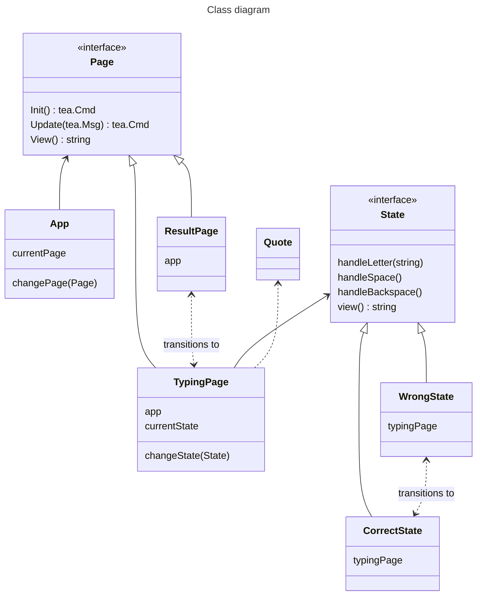

```mermaid
---
title: Class diagram
---
classDiagram
    direction BT
    class App {
      currentPage
      changePage(Page)
    }

    class Page {
      <<interface>>

      Init() tea.Cmd
      Update(tea.Msg) tea.Cmd
      View() string
    }
    class TypingPage {
      app
      currentState
      changeState(State)
    }
    class ResultPage{
      app
    }
    class Quote {
    }

    class State {
      <<interface>> 

      handleLetter(string)
      handleSpace()
      handleBackspace()
      view() string
    }
    class CorrectState {
      typingPage
    }
    class WrongState {
      typingPage
    }

    App --> Page
    TypingPage --|> Page
    ResultPage --|> Page
    TypingPage <..> ResultPage : transitions to

    TypingPage --> State
    CorrectState --|> State
    WrongState --|> State
    CorrectState <..> WrongState : transitions to

    TypingPage ..> Quote
```